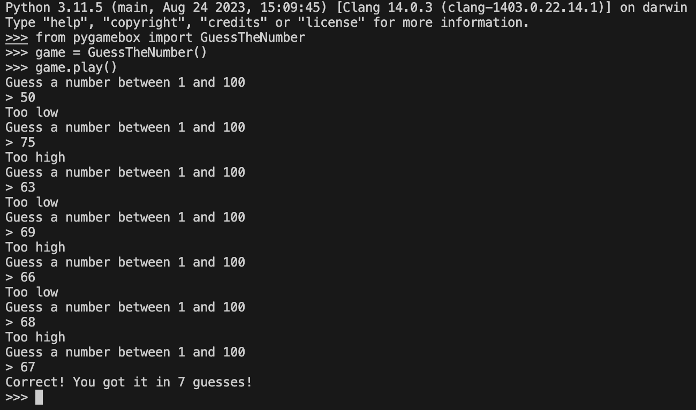
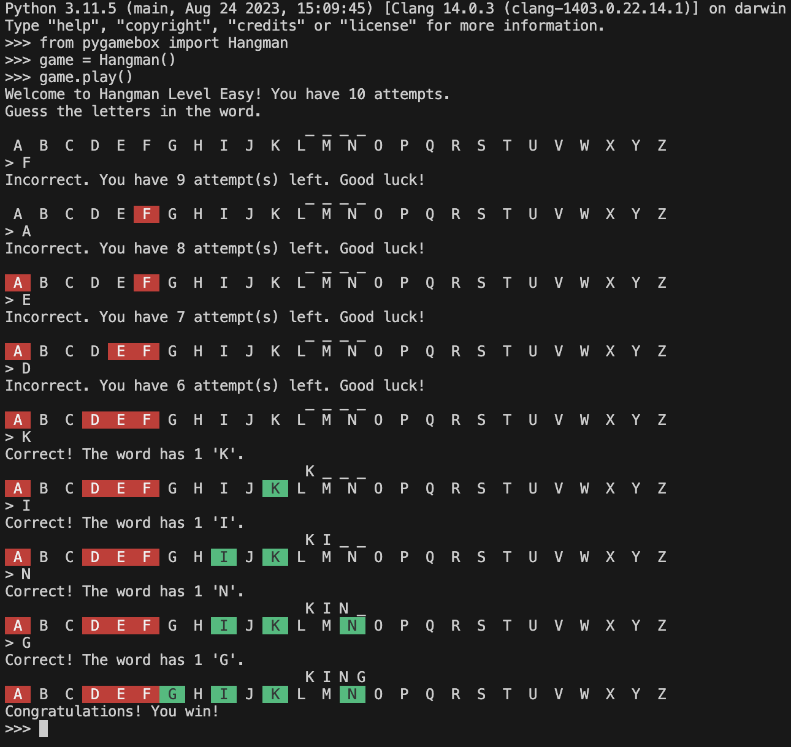
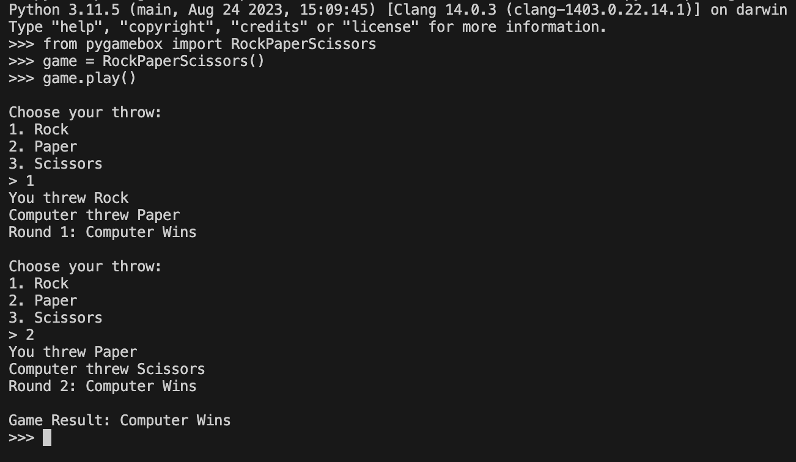
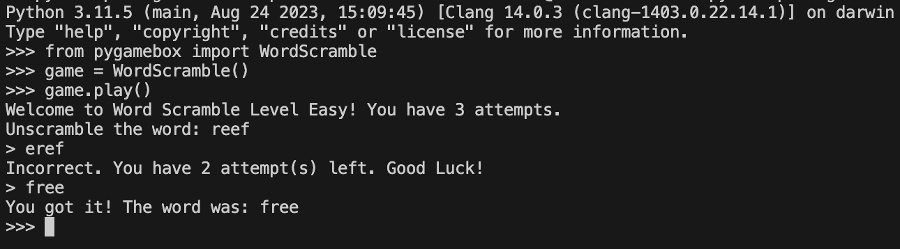
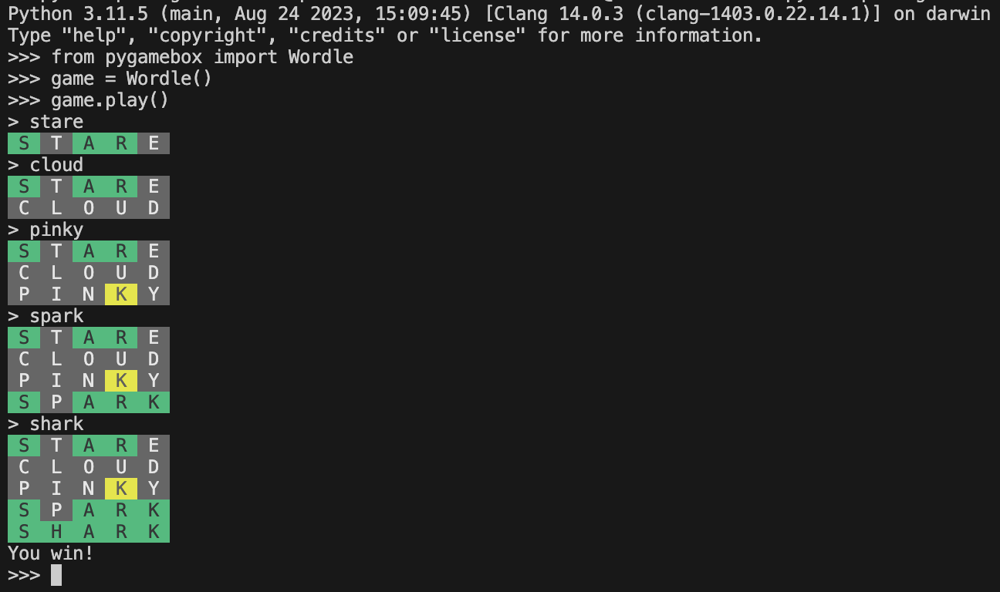

# PyGameBox

[](https://github.com/software-students-fall2023/3-python-package-exercise-prime-order/actions/workflows/build-release.yml)

# Team Members

* [Aavishkar Gautam](https://github.com/aavishkar6)
* [Avaneesh Devkota](https://github.com/avaneeshdevkota)
* [Soyuj Jung Basnet](https://github.com/basnetsoyuj)

# Description

PyGameBox is a versatile Python package that simplifies the development of several popular games. It abstracts away the intricate details of game logic, allowing you to effortlessly import and integrate games like "Guess the Number", "Hangman", "Rock, Paper, Scissors", "Word Scramble", and "Wordle" into your own projects.

# Getting Started

## Prerequisites

Before you start, make sure you have Python 3.x installed on your system. You can download Python from the [official website](https://www.python.org/downloads/).

## Installation

You can install the package via pip:

```bash
pip install pygamebox
```

## Using it
After installing the package, import PyGameBox to your program. 
```python
from pygamebox import *
```

PyGameBox consists of 5 different games. If you want to have an implement any one of the 5 games, you can simply import it, instantiate a game object, and call `play()` on the game object. PyGameBox will handle all the game logic. However, if you wish to handle the game logic yourself, PyGameBox also provides you with a host of helper functions designed to make the implementation as simple as use.

## Guess The Number
```python
from pygamebox import GuessTheNumber

game = GuessTheNumber()
game.play()
```

### Methods:
1. `__init__(self, start: int = 1, end: int = 100) -> None`
    * **Description**: Initializes a new GuessTheNumber game.
    * **Parameters**:
        * start (int): The lower bound of the number range (default is 1).
        * end (int): The upper bound of the number range (default is 100).

2. `reset(self) -> None`
    * **Description**: Resets the game by generating a new random number and setting the number of guesses to 0.

3. `get_user_guess(self) -> str`
    * **Description**: Gets the user's guess as a string.
    * **Returns**: The user's guess as a string.

4. `validate_input(self, guess: Union[str, int]) -> bool`
    * **Description**: Validates the user's guess.
    * **Parameters**:
        * guess (Union[str, int): The user's guess.
    * **Returns**: True if the guess is valid, False otherwise.

5. `guess(self, user_guess: int) -> int`
    * **Description**: Checks if the user's guess is correct.
    * **Parameters**:
        * user_guess (int): The user's guess.
    * **Returns**:
        * -1 if the guess is too low.
        * 1 if the guess is too high.
        * 0 if the guess is correct.

6. `turn(self, user_guess: Union[str, int]) -> bool`
    * **Description**: Runs a turn of the game.
    * **Parameters**:
        * user_guess (Union[str, int]): The user's guess.
    * **Returns**: True if the user guessed the number, False otherwise.

7. `play(self) -> None`
    * **Description**: Plays the game. Continues playing until the user guesses the correct number.

### Screenshot


## Hangman
```python
from pygamebox import *

game = Hangman()
game.play()
```

### Methods:
1. `__init__(self) -> None`
    * **Description**: Initializes the Hangman game with a set of words for different difficulty levels.
    * **Parameters**: None.

2. `reset(self, difficulty: str, attempts: int) -> None`
    * **Description**: Resets the game to the specified difficulty level and number of attempts.
    * **Parameters**:
        * difficulty (str): The difficulty level. Default difficulty is 'easy'.
        * attempts (int): The number of attempts allowed. Default number of attempts is 3.
        * Returns: None.

3. `get_word_list(self, difficulty: str) -> list[str]`
    * **Description**: Retrieves a list of words based on the specified difficulty level.
    * **Parameters**:
        * difficulty (str): The difficulty level.
    * **Returns**: A list of words for the given difficulty.

4. `validate_input(self, user_input: str) -> bool`
    * **Description**: Validates the user's input to ensure it is a single letter that hasn't been guessed.
    * **Parameters**:
        * user_input (str): The user's input.
    * **Returns**: True if the input is valid, False otherwise.

5. `guess(self, user_input: str) -> bool`
    * **Description**: Checks if the user's guess is correct and updates the game status.
    * **Parameters**:
        * user_input (str): The user's guess.
    * **Returns**: True if the user has guessed the entire word, False otherwise.
6. `print_partial(self) -> None`
    * **Description**: Prints the word with the guessed letters filled in and displays the letters remaining to guess.
    * **Returns**: None.

7. `play(self, difficulty: str = 'easy', attempts: int = 10) -> None`
    * **Description**: Initiates and plays the Hangman game.
    * **Parameters**:
        * difficulty (str, optional): The difficulty level (default is 'easy').
        * attempts (int, optional): The number of attempts allowed (default is 10).
    * **Returns**: None.

### Screenshot


## Rock, Paper, Scissors
```python
from pygamebox import *

game = RockPaperScissors()
game.play()
```
### Methods:
1. `__init__(self) -> None`
    * Description: Initializes the RockPaperScissors game.
    * Parameters: None.
2. `get_user_throw(self) -> int`
    * Description: Gets the user's choice for Rock, Paper, or Scissors.
    * Returns: The user's choice `x` as an integer `x-1` (0: Rock, 1: Paper, 2: Scissors).
3. `validate_input(self, user_input: Union[str, int]) -> bool`
    * Description: Validates the user's input to ensure it's a valid choice (1, 2, or 3).
    * Parameters:
        *user_input (Union[str, int]): The user's input.
    * Returns: True if the input is valid, False otherwise.
4. `throw() -> int`
    * Description: Generates a random choice for the computer (Rock, Paper, or Scissors).
    * Returns: The computer's choice as an integer (0: Rock, 1: Paper, 2: Scissors).
5. `round(user_throw: int, computer_throw: int) -> int`
    * Description: Determines the result of a round based on the user's and computer's choices.
    * Parameters:
        * user_throw (int): The user's choice.
        * computer_throw (int): The computer's choice.
    * Returns:
        * 1 if the user wins.
        * -1 if the computer wins.
        * 0 if it's a draw.
6. `validate_round_input(rounds: int) -> bool`
    * Description: Validates the user's input to ensure it's a valid number of rounds (1 or greater).
    * Parameters:
        * rounds (int): The number of rounds to play.
    * Returns: True if the input is valid, False otherwise.
7. `play(self, rounds: int = 1) -> None`
    * Description: Runs the Rock, Paper, Scissors game for a specified number of rounds.
    * Parameters:
        *rounds (int, optional): The number of rounds to play (default is 1).
    * Returns: None.

### Screenshot


## Word Scramble
```python
from pygamebox import *

game = WordScramble()
game.play()
```
### Methods:
1. `__init__(self) -> None`
    * Description: Initializes the WordScramble game with a list of words categorized by difficulty, the current word, its scrambled form, and the number of attempts.
    * Parameters: None.
2. `reset(self, difficulty: str, attempts: int) -> None`
    * Description: Resets the game to the specified difficulty level and number of attempts, generating a new word to unscramble.
    * Parameters:
        * difficulty (str): The difficulty level.
        * attempts (int): The number of attempts allowed.
    * Returns: None.
3. `scramble_word(word: str) -> str`
    * Description: Scrambles a given word, creating a jumbled version.
    * Parameters:
        * word (str): The word to scramble.
    * Returns: The scrambled word.
4. `get_word_list(self, difficulty: str) -> list[str]`
    * Description: Retrieves a list of words based on the specified difficulty level.
    * Parameters:
        * difficulty (str): The difficulty level.
    * Returns: A list of words for the given difficulty.
5. `validate_input(self, user_input: str) -> bool`
    * Description: Validates the user's input to ensure it contains the same characters as the scrambled word.
    * Parameters:
        * user_input (str): The user's input.
    * Returns: True if the input is valid, False otherwise.
6. `guess(self, user_input: str) -> bool`
    * Description: Checks if the user's guess is correct and updates the game status.
    * Parameters:
        * user_input (str): The user's input.
    * Returns: True if the guess is correct, False otherwise.
7. `play(self, difficulty: str = 'easy', attempts: int = 3) -> None`
    * Description: Initiates and plays the Word Scramble game for a specified difficulty level and number of attempts.
    * Parameters:
        * difficulty (str, optional): The difficulty level (default is 'easy').
        * attempts (int, optional): The number of attempts allowed (default is 3).
    * Returns: None.

### Screenshot


### Wordle
```python
from pygamebox import *

game = Wordle()
game.play()
```
### Methods:
1. `__init__(self) -> None`
    * Description: Initializes the Wordle game with a list of possible words, valid words, and game parameters, such as the current word, guesses, and attempts.
    * Parameters: None.
2. `reset(self, attempts: int = DEFAULT_ATTEMPTS) -> None`
    * Description: Resets the game, generating a new word to guess and resetting the guesses and attempts.
    * Parameters:
        * attempts (int, optional): The number of attempts allowed (default is DEFAULT_ATTEMPTS).
    * Returns: None.
3. `get_user_input() -> str`
    * Description: Gets the user's input (the guessed word).
    * Returns: The user's input as a string.
4. `validate_input(self, guess: str) -> bool`
    * Description: Validates the user's input to ensure it's a valid word.
    * Parameters:
        * guess (str): The user's input (guessed word).
    * Returns: True if the word is valid, False otherwise.
5. `check_win(self, guess: str) -> bool`
    * Description: Checks if the user's guess is correct (equals the hidden word).
    * Parameters:
        * guess (str): The user's input (guessed word).`
    * Returns: True if the guess is correct, False otherwise.
6. `check_guess(self, guess: str) -> list[int]`
    * Description: Checks the correctness of each character in the guessed word and provides feedback.
    * Parameters:
7. `guess (str): The user's input (guessed word).`
    * Returns: A list of integers representing the status of each character in the guess (0: Correct, 1: Misplaced, -1: Not present).
8. `print_output(self) -> None`
    * Description: Prints the Wordle game state, including feedback on previous guesses.
    * Returns: None.
7. `play(self, attempts: int = DEFAULT_ATTEMPTS) -> None`
    * Description: Initiates and plays the Wordle game for a specified number of attempts.
    * Parameters:
        * attempts (int, optional): The number of attempts allowed (default is DEFAULT_ATTEMPTS).
    * Returns: None.

### Screenshot


# Contributing

If you'd like to contribute to the PyGameBox project, follow these steps to set up your development environment:

* Clone the repository:
```bash
git clone https://github.com/software-students-fall2023/3-python-package-exercise-prime-order.git
```
* cd to the folder and activate virutal environment:
```bash
pipenv shell
```
* Download dependencies.
```bash
pipenv install
```
* You can work on the module, add other games, or resolve existing issues. Create unit tests for your functions to test them.
```bash
python -m pytest
```
Push your code changes, create a pull request and contribute to the project's development.
